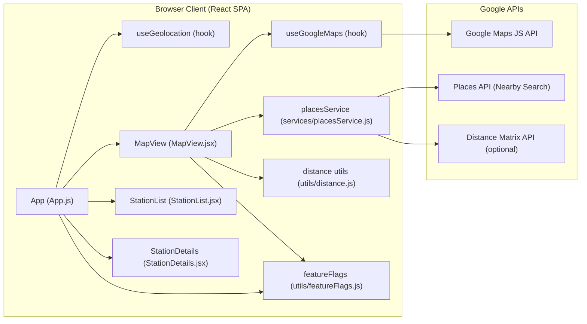
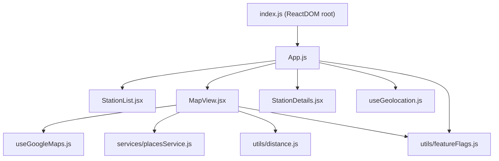
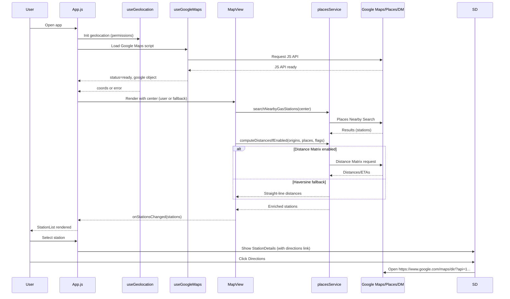
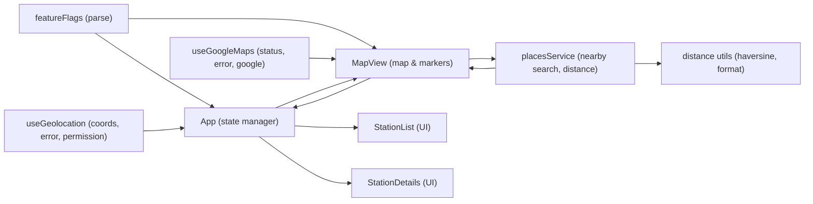
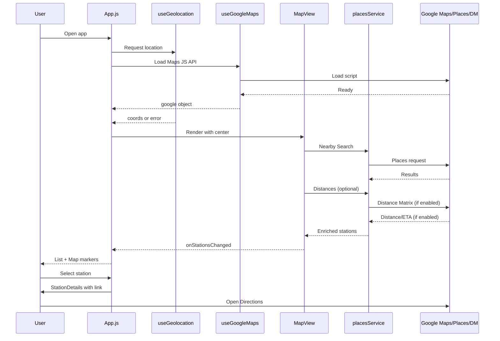
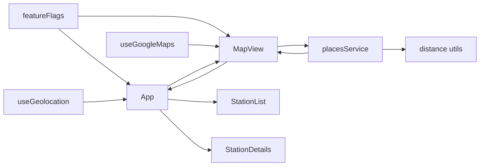

# Architecture Document - Nearby Gas Station Finder

## Executive Summary
The Nearby Gas Station Finder is a single-container React web application that helps users locate nearby gas stations. It integrates with the Google Maps JavaScript API and Google Places API to render a map, search for nearby gas stations, and compute distances and estimated travel times. The app prioritizes privacy and security by keeping secrets out of the source code, using environment variables, and providing user-friendly, sanitized error messages. Geolocation is used when permitted to enhance relevance and accuracy, and the app degrades gracefully when permissions are denied or unavailable.

## System Overview
The system is a client-side application built with React (Create React App tooling), running entirely in the browser. It:
- Dynamically loads the Google Maps JavaScript API using an API key (provided via environment variable).
- Retrieves the user’s location via the browser Geolocation API (with permission).
- Uses Places Nearby Search to fetch gas stations around the current map center.
- Computes distance via the Distance Matrix API when feature-flagged, or falls back to the Haversine formula for straight-line distances.
- Displays stations on the map and in a paginated list, and provides a link to open Google Maps directions for a selected station.

Core files and modules:
- Components: App.js, components/MapView.jsx, components/StationList.jsx, components/StationDetails.jsx
- Hooks: hooks/useGeolocation.js, hooks/useGoogleMaps.js
- Services: services/placesService.js
- Utilities: utils/distance.js, utils/featureFlags.js
- Styles: src/App.css, src/index.css
- Entry and HTML template: src/index.js, public/index.html

## Key Requirements and Constraints
- Functional:
  - Show nearby gas stations relative to the map center and optionally user geolocation.
  - Provide user-friendly distances and directions linkouts.
  - Work when location permission is denied by allowing map panning.
- Non-functional:
  - Secure handling of API keys (no secrets in code, use environment variables).
  - Geolocation requires HTTPS or localhost.
  - Minimize API quota usage via debounced map events and result limits.
  - Accessible UI with focus styles and sufficient contrast.
- Constraints:
  - Dependent on Google Maps, Places, and optionally Distance Matrix APIs.
  - Browser-powered; no backend in the current architecture.
  - React client build via CRA (react-scripts).

## High-Level Architecture
The app is a single-page React application. It loads Google Maps JS API in the browser and orchestrates user geolocation, map interactions, places search, and optional distance computation.

Mermaid diagram: High-level architecture

## Component Architecture
- App.js
  - Application shell managing global state: userLocation, mapCenter, stations, selectedStation, loading, errors, and feature flags parsed via REACT_APP_FEATURE_FLAGS.
  - Renders StationList (sidebar), MapView (map), and StationDetails (panel).
  - Applies a light theme and minimal logging controlled by REACT_APP_LOG_LEVEL.
  - File: src/App.js
- MapView.jsx
  - Initializes and renders a Google Map, manages markers, listens to debounced idle events, updates center via onCenterChanged, and fetches stations via placesService.
  - Optionally computes distances using Distance Matrix; falls back to Haversine if disabled or failing.
  - Emits station lists to App and highlights selected stations.
  - File: src/components/MapView.jsx
- StationList.jsx
  - Paginated list of stations with ratings and distances; users can select a station to focus on details and map.
  - File: src/components/StationList.jsx
- StationDetails.jsx
  - Displays selected station’s name, address, rating, distance, and ETA when available.
  - Provides a directions link that opens Google Maps in a new tab using https://www.google.com/maps/dir/?api=1 with origin/destination parameters.
  - File: src/components/StationDetails.jsx
- Hooks:
  - useGeolocation.js: Wraps browser Geolocation API with permission and error handling, exposes coords, permission, error, refresh.
    - File: src/hooks/useGeolocation.js
  - useGoogleMaps.js: Dynamically loads Google Maps JS API by injecting a script configured with REACT_APP_GOOGLE_MAPS_API_KEY; exposes status, error, and google object.
    - File: src/hooks/useGoogleMaps.js
- Services:
  - placesService.js:
    - searchNearbyGasStations: Uses google.maps.places.PlacesService to find gas stations near a given location.
    - computeDistancesIfEnabled: Uses Distance Matrix API if feature-flagged and origin provided; otherwise uses Haversine as fallback for distance approximation.
    - File: src/services/placesService.js
- Utilities:
  - distance.js: Haversine distance in meters, meters-to-km/miles, and human-friendly formatters.
    - File: src/utils/distance.js
  - featureFlags.js: Parses REACT_APP_FEATURE_FLAGS into an object for runtime checks.
    - File: src/utils/featureFlags.js
- Styles:
  - src/App.css, src/index.css define modern, accessible styling and layout including sticky header, responsive grid, and focus outlines.

Mermaid diagram: Component hierarchy

## Data Flow and Sequence Diagrams
Sequence: App load to directions

Data flow between hooks, services, utils, and UI

## External Services and Integrations
- Google Maps JavaScript API:
  - Loaded via useGoogleMaps using REACT_APP_GOOGLE_MAPS_API_KEY.
  - Provides the global google object, Map, Marker, InfoWindow, LatLng, and other classes.
- Google Places API (Nearby Search):
  - Accessed via google.maps.places.PlacesService in searchNearbyGasStations.
  - Returns nearby gas stations with details like name, vicinity, geometry, rating.
- Google Distance Matrix API (optional):
  - Used in computeDistancesIfEnabled when enableDistanceMatrix feature flag is true and an origin exists.
  - Provides driving distance and duration; otherwise Haversine fallback is used.

## Configuration and Environment Variables
Primary environment variables:
- REACT_APP_GOOGLE_MAPS_API_KEY (required): API key for loading Google Maps JS API.
- REACT_APP_FEATURE_FLAGS (optional): Comma/semicolon separated flags, e.g., enableDistanceMatrix=true.
- REACT_APP_LOG_LEVEL (optional): debug|info|warn|error; defaults to warn.

Other container variables supported but optional (currently not required by the code paths):
- REACT_APP_API_BASE, REACT_APP_BACKEND_URL, REACT_APP_FRONTEND_URL, REACT_APP_WS_URL, REACT_APP_NODE_ENV, REACT_APP_NEXT_TELEMETRY_DISABLED, REACT_APP_ENABLE_SOURCE_MAPS, REACT_APP_PORT, REACT_APP_TRUST_PROXY, REACT_APP_HEALTHCHECK_PATH, REACT_APP_EXPERIMENTS_ENABLED

Configuration behavior:
- Feature flags are parsed at runtime via utils/featureFlags.js and supplied to MapView and placesService.
- No secrets are hardcoded; keys must be set in the environment before build/run.
- The HTML entry (public/index.html) is a standard template; the app mounts at #root.

## Security and Compliance Considerations
- No hardcoded secrets: All keys and flags must be injected via environment variables; enforce proper API key restrictions in Google Cloud (HTTP referrers).
- Sanitized error handling: User-facing messages avoid sensitive details. Internal console logging is minimal and controlled via REACT_APP_LOG_LEVEL.
- HTTPS requirement for geolocation: Browsers require HTTPS or localhost to access geolocation; the app communicates this in documentation and handles denial gracefully.
- Minimal logging: Default log level discourages verbose logs in production; debug logging is opt-in via REACT_APP_LOG_LEVEL=debug.
- External links: Directions links open in a new tab with rel="noopener noreferrer" to reduce tab-napping risk.
- Dependency hygiene: ESLint configured; CRA scripts for building; keep dependencies up to date and apply security scanning in CI/CD where applicable.

## Performance and Reliability
- Quota efficiency:
  - Debounced map idle events (500ms) before fetching to reduce Places API calls.
  - Limits results/markers (e.g., maxMarkers=50) to balance UX and performance.
- Distance computation:
  - Uses Distance Matrix only when needed and feature-flagged; otherwise uses a lightweight Haversine fallback to reduce external calls.
- Rendering:
  - Paginated list to avoid rendering a large number of items at once.
- Resilience:
  - Try/catch around service calls with friendly fallbacks and user messages.
  - If Distance Matrix fails, the code falls back to Haversine without breaking the UX.

## Deployment and Operations
- Build:
  - Standard CRA flow via npm run build; outputs a static bundle suitable for serving from any static host/CDN.
- Run (development):
  - npm start launches a local dev server at http://localhost:3000.
- Operations:
  - Ensure REACT_APP_GOOGLE_MAPS_API_KEY is provided at build time and properly restricted.
  - Serve over HTTPS in production to enable geolocation.
  - Monitor browser error logs during development; in production, consider integrating a client-side error monitoring solution that respects privacy and does not capture sensitive data.

## Future Enhancements
- Caching and rate limiting:
  - Introduce local caching of previous searches to reduce API calls when panning slightly.
- Offline/user hints:
  - Show additional guidance when APIs are unavailable or quota exceeded.
- Additional filters and sorting:
  - Filter by open-now, price level, or distance; sort by ETA when Distance Matrix is enabled.
- Accessibility improvements:
  - Keyboard shortcuts to focus map/list, ARIA enhancements on map markers via an accessible list representation.
- Internationalization:
  - Localize UI strings and units based on user locale.
- Observability:
  - Add non-PII telemetry for performance and error analytics.

## Visual Appendices

High-level architecture (duplicate for quick reference)

Sequence: user journey

Data flow: hooks/services/utils to UI

