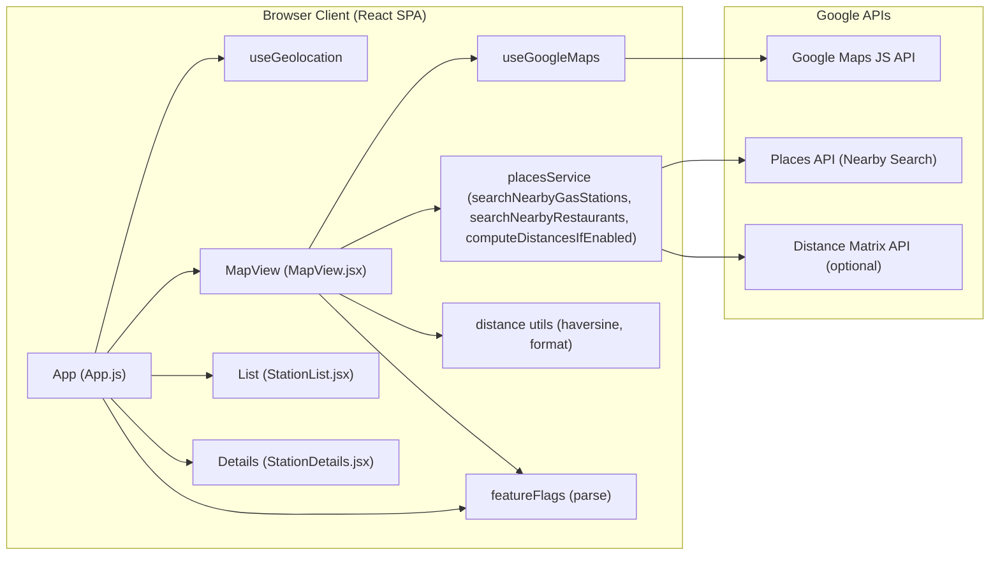
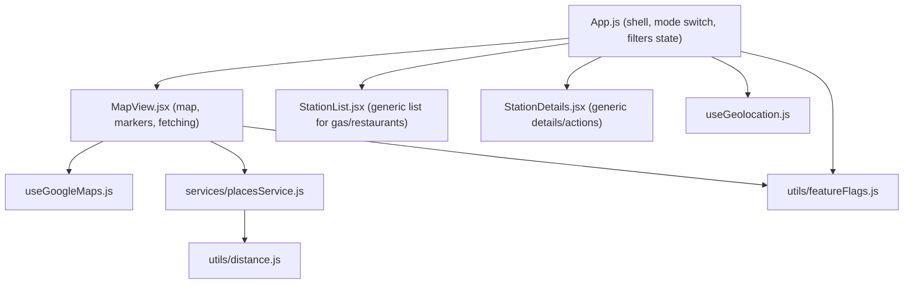
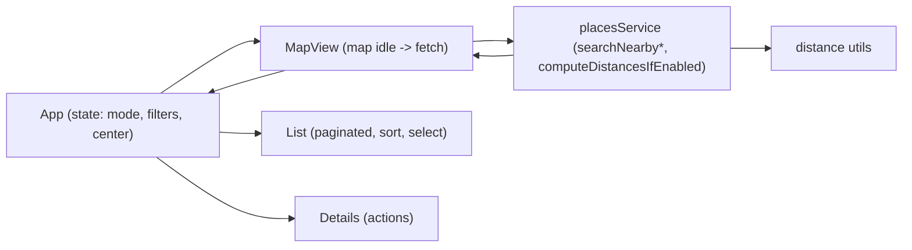

# Design Document: Restaurant Lookup Extension

## Problem Statement
The Nearby Gas Station Finder is a React single-page app that uses Google Maps, Places Nearby Search, and optional Distance Matrix to help users locate nearby gas stations. We need to extend the app to support restaurant lookups while reusing the existing architecture, hooks, services, and UI patterns. The solution must be feature-flagged, adhere to existing style guide colors and accessibility, and respect enterprise security standards, without adding new npm dependencies unless necessary.

## Goals and Non-Goals
### Goals
- Add the ability to search and browse nearby restaurants in addition to gas stations.
- Reuse existing hooks, services, and UI patterns:
  - Hooks: useGeolocation, useGoogleMaps
  - Services: placesService
  - Components: MapView, list/details patterns, styles
- Introduce feature flags under REACT_APP_FEATURE_FLAGS to gate:
  - restaurants.enabled
  - restaurants.useDistanceMatrix (optional optimization)
- Provide UX for filters and sorting:
  - Cuisine type (e.g., Italian, Chinese, Mexican…), rating threshold, and open-now
  - Pagination retained from existing list pattern
  - Sorting by distance, rating, or ETA (when Distance Matrix is enabled)
- Provide item actions: call, website, directions
- Maintain performance and quota efficiency with debounced map interactions and reasonable limits
- Provide an incremental rollout plan with acceptance criteria per phase
- Document environment variable updates and .env.example snippet

### Non-Goals
- No backend introduction or server-side persistence (favorites Phase 3 will outline client-side and optional future backend but not implement server changes here).
- No new UI library dependencies beyond current stack.
- No design system overhaul; follow existing styles and colors.

## User Stories
- As a user, I can switch to a Restaurants view to see nearby restaurants on the map and in a list.
- As a user, I can filter restaurants by cuisine, minimum rating, and open now to refine results.
- As a user, I can sort restaurant results by distance, rating, or ETA (if enabled).
- As a user, I can page through results without overwhelming the UI.
- As a user, I can view details for a restaurant and quickly take actions to call, view the website, or get directions.
- As a user, I can still use the app if I deny geolocation by panning/zooming the map.

## Functional Requirements
- Provide a Restaurants mode that:
  - Uses Google Places Nearby Search with `type: ['restaurant']` and optional `keyword`/`cuisine` input.
  - Supports filters:
    - Cuisine: translates into Places request parameters (e.g., `keyword` for cuisine type)
    - Rating threshold: client-side filter ≥ selected rating
    - Open now: use `openNow: true` in Places request (JS API supports `openNow` in Nearby Search)
  - Supports sorting by:
    - Distance (straight-line via Haversine or Distance Matrix distance)
    - Rating
    - ETA (requires Distance Matrix enabled and successful response)
  - Pagination using existing pattern (page size ~10)
- Map markers:
  - Use distinct marker styling for restaurants vs. gas stations (e.g., color variation)
  - Clicking a marker selects the restaurant, opens an info window, and highlights the list item
- Details view:
  - Show name, vicinity, rating, distance/ETA (if available)
  - Actions: Call (tel: if phone known), Website (if available via Place Details; for Nearby Search base, link using `place_id` to Google Maps place URL), Directions (existing deep link)
- Feature Flags (parsed via utils/featureFlags.js):
  - restaurants.enabled=true|false
  - restaurants.useDistanceMatrix=true|false
- Use optional Distance Matrix to compute road distance and ETA when enabled; fallback to Haversine otherwise.

## Non-Functional Requirements
- Accessibility:
  - Keyboard navigable list and controls
  - Visible focus states and ARIA labels following existing patterns
  - Sufficient color contrast using style guide colors
- Security and privacy:
  - No secrets in source code; use env vars; restrict API keys
  - Sanitize user-facing errors, do not leak sensitive details
  - Respect HTTPS requirement for geolocation
- Performance:
  - Debounced map idle events
  - Reasonable result and marker caps (e.g., 50)
  - Avoid unnecessary re-renders and computations
- Reliability:
  - Graceful fallback when Distance Matrix fails
  - Friendly user messages for quota or API errors

## APIs and SDK Usage
- Google Maps JavaScript API:
  - Loaded via useGoogleMaps hook
- Google Places API (Nearby Search):
  - For restaurants, use `type: ['restaurant']`
  - Support `openNow: true` when filtering and a `keyword` with cuisine terms (e.g., "italian", "sushi")
- Google Distance Matrix API (optional):
  - Triggered when restaurants.useDistanceMatrix is true and user origin known
  - Compute road distance and ETA for returned places
- Optional: Place Details API could be used in future for richer actions (phone/website). For Phase 1–2, we will rely on what Nearby Search returns and Google Maps place URLs constructed from place_id.

## Architecture Changes
The existing single-container architecture remains intact. We introduce a mode for restaurants, additional filter controls, and minimal changes to the placesService to support restaurants.

- Extend placesService to add:
  - searchNearbyRestaurants({ google, location, radius, limit, keyword, openNow })
  - reuse computeDistancesIfEnabled for distance/ETA when restaurants.useDistanceMatrix is flagged
- MapView:
  - Add props to handle a generic "placeType" mode: 'gas' | 'restaurant'
  - Add support for filters (cuisine keyword, rating threshold, openNow)
  - Render restaurant markers with different icon color while keeping UX consistent
- StationList/StationDetails:
  - Factor into generic components (or light branching) to render restaurants; avoid duplicating UI code
- Feature flags extended via utils/featureFlags:
  - restaurants.enabled, restaurants.useDistanceMatrix
- App shell:
  - New toggle control in header to switch between Gas and Restaurants when restaurants.enabled
  - Filters UI when in Restaurants mode

### System Context Diagram


### Component Diagram (High Level)


### Data Flow Diagram


### Sequence: Restaurant Search and Details
```mermaid
sequenceDiagram
  participant User as User
  participant App as App.js
  participant MV as MapView
  participant PS as placesService
  participant GMaps as Google Maps/Places/DM
  participant List as List
  participant Details as Details

  User->>App: Toggle Restaurants mode
  App->>MV: Render with mode='restaurant' & filters
  MV->>PS: searchNearbyRestaurants(center, filters)
  PS->>GMaps: Places Nearby Search (type=restaurant, openNow?, keyword=cuisine?)
  GMaps-->>PS: Results (restaurants)
  alt restaurants.useDistanceMatrix enabled and user origin available
    MV->>PS: computeDistancesIfEnabled(origins, places, flags)
    PS->>GMaps: Distance Matrix request
    GMaps-->>PS: Distance/ETAs
    PS-->>MV: Enriched places
  else Haversine fallback
    PS->>Dist: Compute straight-line distances
    PS-->>MV: Enriched places
  end
  MV-->>App: onPlacesChanged(restaurants)
  App-->>List: Render list (pagination, sorting)
  User->>List: Select restaurant
  App->>Details: Show details with actions (call, website, directions)
  User->>Details: Open Directions / Website / Call
```

## Component Updates

### App.js
- Add mode state: 'gas' | 'restaurant' (default 'gas')
- Add filters state when mode is 'restaurant':
  - cuisine: string
  - ratingMin: number (e.g., 0–5)
  - openNow: boolean
  - sortBy: 'distance' | 'rating' | 'eta'
- Header UI:
  - Mode switch button group to toggle Gas/Restaurants (Restaurants visible only when restaurants.enabled)
  - Filter controls visible in Restaurants mode:
    - Cuisine select/input
    - Rating threshold select (e.g., Any, 3.5+, 4.0+, 4.5+)
    - Open now checkbox
    - Sort by select

### MapView.jsx
- Add props:
  - mode: 'gas' | 'restaurant'
  - filters: { cuisine?: string, ratingMin?: number, openNow?: boolean, sortBy?: 'distance'|'rating'|'eta' }
- Fetch logic:
  - If mode === 'gas': existing `searchNearbyGasStations`
  - If mode === 'restaurant': new `searchNearbyRestaurants`
    - Include `openNow` and `keyword` based on cuisine
  - Enrich with computeDistancesIfEnabled using restaurants.useDistanceMatrix when mode is restaurant, else existing flag enableDistanceMatrix
- Markers:
  - Gas markers: current style
  - Restaurant markers: change icon color to align with style guide (e.g., primary accent for selection, secondary for default)

### StationList.jsx
- Generalize title to be conditional based on mode: "Nearby Gas Stations" or "Nearby Restaurants"
- Sorting:
  - Apply client-side sorting based on chosen sortBy
- Filtering:
  - Apply client-side ratingMin filter after fetch (Places results include rating)
- Pagination: unchanged pattern

### StationDetails.jsx
- Make labels generic (e.g., "Place" vs "Gas station") or conditional by mode.
- Actions:
  - Directions: existing deep link
  - Website: if `place.website` exists (available via Place Details; Nearby Search may not always include), otherwise a Google Maps place URL: `https://www.google.com/maps/search/?api=1&query=Google&query_place_id=<place_id>`
  - Call: if `place.formatted_phone_number` exists (Place Details), otherwise omit. In Phase 1–2, show Website and Directions reliably; Call is best-effort if data available.

## Hooks and Services Updates

### useGeolocation.js and useGoogleMaps.js
- No changes required.

### services/placesService.js
- Add `searchNearbyRestaurants` that mirrors `searchNearbyGasStations` but uses:
  - `type: ['restaurant']`
  - `openNow` when requested
  - `keyword` when cuisine provided
- Reuse `computeDistancesIfEnabled`:
  - For restaurants, use `flags.restaurants.useDistanceMatrix` if present; otherwise fallback to `enableDistanceMatrix` for backward compatibility
- Sorting and rating filter are primarily client-side in components; keep service focused on API calls and distance computation.

## Feature Flags and Configuration
- REACT_APP_FEATURE_FLAGS supports:
  - restaurants.enabled=true|false
  - restaurants.useDistanceMatrix=true|false
  - enableDistanceMatrix=true (existing for gas)
- Example values:
  - `REACT_APP_FEATURE_FLAGS=enableDistanceMatrix=true,restaurants.enabled=true,restaurants.useDistanceMatrix=false`
- Parsing continues via utils/featureFlags.js.

### .env.example Update Snippet
Add the following snippet to .env.example:
```
# Restaurant feature flags
# Enable restaurant lookup features (UI toggle and fetching)
REACT_APP_FEATURE_FLAGS=restaurants.enabled=true,restaurants.useDistanceMatrix=false
# Combine with existing flags; examples:
# REACT_APP_FEATURE_FLAGS=enableDistanceMatrix=true,restaurants.enabled=true,restaurants.useDistanceMatrix=true
```

## Security and Privacy
- No hardcoded API keys; use REACT_APP_GOOGLE_MAPS_API_KEY
- Restrict keys via HTTP referrers in Google Cloud
- Minimal logging; no PII; respect REACT_APP_LOG_LEVEL defaulting to warn
- HTTPS or localhost for geolocation
- External links:
  - Use target="_blank" with rel="noopener noreferrer"
- Input handling:
  - Cuisine strings should be sanitized for display contexts and used as `keyword` in Places (avoid injecting unsafe data into HTML strings)
- Dependency constraints:
  - No new npm deps unless necessary; rely on existing JS SDKs

## Accessibility
- Maintain focus outline and tab order for new controls
- ARIA labels for:
  - Mode switch controls (e.g., aria-label="Select search category")
  - Filters region (e.g., role="region" aria-label="Restaurant filters")
  - List container and item semantics retained
- Color contrast:
  - Use existing CSS variables ensuring adequate contrast

## Performance Considerations
- Debounced map idle events remain at 500 ms
- Limit markers to 50 to avoid clutter and excessive DOM work
- Client-side filtering and sorting applied after fetch to reduce repeat API calls
- Distance Matrix calls are optional and feature-flagged; fallback to Haversine

## Error Handling
- Friendly user messages:
  - "Failed to load nearby restaurants. Please try again shortly."
  - "No restaurants found for this area. Try zooming out or panning the map."
- Geolocation denied/timeout messages retained
- If Distance Matrix fails, continue with Haversine distances

## Rollout Plan
- Phase 1: Nearby restaurants
  - restaurants.enabled=true reveals Restaurants mode with nearby results and directions
  - Sorting by distance or rating; no filters yet (optional minimal filters if straightforward)
  - Acceptance Criteria:
    - Toggle to Restaurants appears when flag enabled
    - Map and list show nearby restaurants
    - Directions link works from details
    - No console errors in normal flow
- Phase 2: Filters (cuisine, rating, open-now) and optional Distance Matrix
  - Add filter UI and integrate into Nearby Search
  - Add restaurants.useDistanceMatrix flag support
  - Sorting includes ETA when Distance Matrix is active
  - Acceptance Criteria:
    - Filters correctly change fetched results
    - Rating filter is applied client-side
    - Open now filter included in request
    - Optional ETA sorting functions when available
- Phase 3: Favorites
  - Allow marking a restaurant as a favorite (client-side store; optional future backend)
  - Acceptance Criteria:
    - Users can add/remove favorites and see a favorites list filter
    - State persists in session (e.g., localStorage) without backend

## Risks and Mitigations
- Quota overuse:
  - Debounced map movement, result limits, selective Distance Matrix usage
- Data variability from Places Nearby Search:
  - Some fields (website, phone) may be missing; use Google Maps place URLs as fallback; degrade gracefully
- UI clutter with additional controls:
  - Keep filters collapsed on small screens; adhere to existing layout responsiveness
- Feature flag misconfiguration:
  - Provide docs and default safe values; app runs without restaurants.enabled

## Testing Strategy
- Unit tests:
  - utils/featureFlags parsing for nested flags (restaurants.*)
  - placesService.searchNearbyRestaurants constructs correct requests (mock google)
  - computeDistancesIfEnabled respects restaurants.useDistanceMatrix
- Integration tests (manual/automated):
  - Mode switching Gas/Restaurants
  - Filters affecting results
  - Sorting correctness
  - Directions/Website actions open correct URLs
- Accessibility checks:
  - Keyboard navigation through filters, list, and actions
- Performance checks:
  - Ensure no excessive rerenders on filter changes
- Error handling:
  - Simulate API failures for Places and Distance Matrix

## Detailed UX Specifications
### Mode Switch
- Location: Header, near "Locate me"
- Controls: Two toggle buttons
  - Gas (default)
  - Restaurants (visible when restaurants.enabled)
- ARIA: role="tablist" or grouped buttons with aria-pressed

### Filters (Restaurants Mode)
- Container: Sidebar header or a collapsible panel at top of list
- Controls:
  - Cuisine:
    - Text input or select with common options (Italian, Chinese, Mexican, Sushi, Indian, American)
    - Used as Places `keyword`
  - Rating:
    - Select: Any, 3.5+, 4.0+, 4.5+
    - Client-side filter on `place.rating`
  - Open Now:
    - Checkbox: sets `openNow: true` in Nearby Search
  - Sort By:
    - Select: Distance, Rating, ETA (ETA disabled if Distance Matrix not enabled)
- Accessibility:
  - Use labels and aria-describedby for hints
- Style:
  - Use existing CSS variables; concise layout matching current sidebar aesthetics

### List and Pagination
- Title changes to "Nearby Restaurants"
- Secondary line shows result count or loading
- Each list item:
  - Name (bold), vicinity (muted), rating, distance (and ETA if available)
  - "View" button focuses map and opens details
- Pagination: unchanged Prev/Next with page info

### Marker Styles
- Gas stations: current default markers
- Restaurants: marker icon color adjusted to primary (#3b82f6) with a small inner dot or alternative stroke
  - Selected marker: bounce briefly on selection (existing behavior)

### Details Actions
- Directions: as existing, crafted from origin/destination
- Website:
  - If Nearby Search provides a direct URL (rare), use it
  - Else fallback: Google Maps place URL using place_id:
    - https://www.google.com/maps/search/?api=1&query=Google&query_place_id=<place_id>
- Call:
  - Only render button if phone is known (requires Place Details; optional future)

## Proposed Interfaces and Code Notes

### services/placesService additions (conceptual interface)
```javascript
/**
 * searchNearbyRestaurants
 * @param {{ google:any, location:{lat:number,lng:number}, radius?:number, limit?:number, keyword?:string, openNow?:boolean }} params
 * @returns {Promise<Array<any>>}
 */
export function searchNearbyRestaurants({ google, location, radius = 5000, limit = 50, keyword, openNow = false }) {
  // Similar to searchNearbyGasStations, but:
  // - type: ['restaurant']
  // - optional openNow
  // - optional keyword for cuisine
}
```

### Flag usage in computeDistancesIfEnabled
```javascript
// flags example structure the UI will produce:
// {
//   enableDistanceMatrix: true,             // existing for gas
//   restaurants: { useDistanceMatrix: true } // new nested flag
// }

const enableDM = mode === 'restaurant'
  ? Boolean(flags?.restaurants?.useDistanceMatrix)
  : Boolean(flags.enableDistanceMatrix);
```

### App state example (sketch)
```jsx
// Pseudocode only
const [mode, setMode] = useState('gas'); // 'gas' | 'restaurant'
const [filters, setFilters] = useState({
  cuisine: '',
  ratingMin: 0,
  openNow: false,
  sortBy: 'distance' // 'distance'|'rating'|'eta'
});
```

## Acceptance Criteria
- Restaurants mode is gated by feature flag and off by default.
- When enabled, user can switch to Restaurants, see nearby results, and open details with actions.
- Filters function:
  - Open now modifies the query
  - Cuisine affects keyword search
  - Rating threshold filters client-side
- Sorting works correctly; ETA sorting only available when Distance Matrix is enabled and data is present.
- Performance:
  - No noticeable UI jank when panning or applying filters
  - API usage remains bounded and debounced
- Accessibility:
  - All new controls labeled, keyboard-navigable, and with visible focus
- Security:
  - No secrets in code; environment and flags documented; safe external links

## Environment Variables
- Existing:
  - REACT_APP_GOOGLE_MAPS_API_KEY (required)
  - REACT_APP_FEATURE_FLAGS (optional)
  - REACT_APP_LOG_LEVEL (optional)
- Container-supported (not directly used by this feature but documented in README):
  - REACT_APP_API_BASE, REACT_APP_BACKEND_URL, REACT_APP_FRONTEND_URL, REACT_APP_WS_URL, REACT_APP_NODE_ENV, REACT_APP_NEXT_TELEMETRY_DISABLED, REACT_APP_ENABLE_SOURCE_MAPS, REACT_APP_PORT, REACT_APP_TRUST_PROXY, REACT_APP_HEALTHCHECK_PATH, REACT_APP_EXPERIMENTS_ENABLED

## Compliance and Enterprise Standards
- Follow NIST SSDF and OWASP:
  - Avoid hard-coded credentials
  - Sanitize/encode outputs for UI
  - Keep logs minimal and non-sensitive
- Follow style guide:
  - Colors: primary #3b82f6, secondary #64748b, success #06b6d4, error hsl(0 84% 60%)
  - Modern, light theme consistent with existing app

## Future Enhancements
- Place Details integration to retrieve phone/website consistently for actions
- Favorites persistence backed by a lightweight backend service
- Caching recent searches to reduce quota
- Internationalization for cuisine and labels
- Observability with non-PII metrics

## References (Source Files)
- Components:
  - src/App.js
  - src/components/MapView.jsx
  - src/components/StationList.jsx
  - src/components/StationDetails.jsx
- Hooks:
  - src/hooks/useGeolocation.js
  - src/hooks/useGoogleMaps.js
- Services:
  - src/services/placesService.js
- Utils:
  - src/utils/distance.js
  - src/utils/featureFlags.js
- Docs:
  - docs/architecture.md
